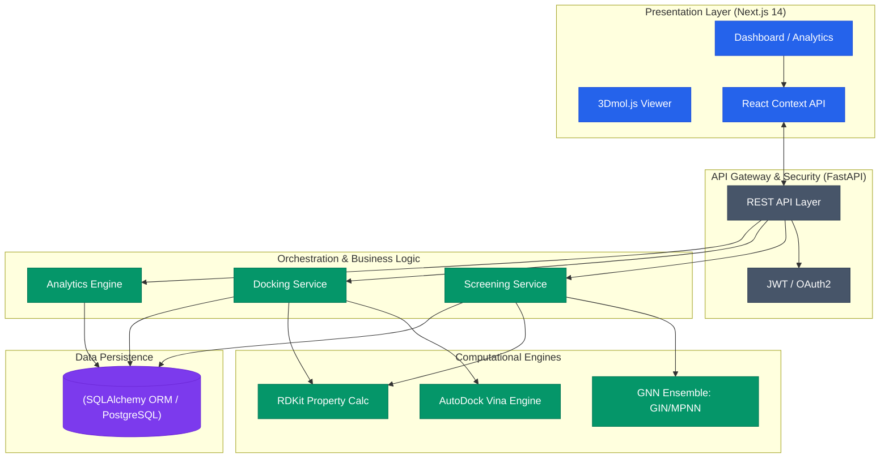

# AI-Assisted End-to-End Drug Discovery Workflow 🧬💊

[](https://fastapi.tiangolo.com/)
[](https://nextjs.org/)
[](https://www.rdkit.org/)
[](https://vina.scripps.edu/)

A state-of-the-art, production-ready pipeline for high-throughput virtual screening and molecular docking. This platform integrates Deep Learning (GNNs) with Physics-based simulations to accelerate the discovery of potent inhibitors for targets like EGFR.

---

## 🏗️ System Architecture

The platform is engineered with a modular, distributed architecture designed to handle high-throughput molecular simulations while providing a real-time, interactive user experience.



---

## 🧩 Module Descriptions

### 4.2.1 User Interface Module
A responsive, high-performance web dashboard built with **Next.js 14** and **Tailwind CSS**. 
- **Interactive 3D Viewer:** Integrated `3Dmol.js` for real-time exploration of protein-ligand docking poses with custom cartoon/stick rendering.
- **Dynamic Analytics:** Real-time visualization of pIC50 distributions, confidence intervals, and Lipinski compliance using `Recharts`.
- **Session Management:** Secure user state handled via React Context API and JWT persistence.

### 4.2.2 API Gateway
The central nervous system of the platform, powered by **FastAPI**.
- **Unified Interface:** Provides a standardized RESTful API for all frontend requests.
- **Security:** Implements OAuth2 with JWT Bearer tokens and password hashing (Passlib).
- **Concurrency:** Leverages Python's `asyncio` to handle multiple screening and docking jobs without blocking the main event loop.

### 4.2.3 Processing Engine
The core logic responsible for the physical world simulation.
- **Docking Orchestration:** Automates the preparation of receptor (PDB) and ligand (SMILES/SDF) files into PDBQT format.
- **AutoDock Vina Integration:** Executes parallelized docking simulations to calculate precise binding affinities (kcal/mol).
- **Lipinski Filtering:** High-speed chemical property filtering (MW, LogP, HBD, HBA) powered by **RDKit**.

### 4.2.4 AI / ML Model Module
A hybrid intelligence layer that combines the speed of Deep Learning with the accuracy of physics.
- **Graph Neural Networks:** Implements **GIN (Graph Isomorphism Network)** and **MPNN (Message Passing Neural Network)** for structural pIC50 prediction.
- **Classical Ensemble:** Includes **Random Forest** and **XGBoost** models trained on diverse molecular descriptors.
- **Uncertainty Quantification:** Provides confidence scores for every prediction, highlighting potential "black swan" molecules.

### 4.2.5 Database Layer
A robust persistence layer using **PostgreSQL** and **SQLAlchemy**.
- **Relational Integrity:** Tracks complex relationships between Users, Screening Runs, and individual Docking Poses.
- **Bulk Persistence:** Optimized for high-throughput writes, allowing for thousands of results to be saved per second.
- **Audit Trail:** Maintains a full history of every discovery run for longitudinal analysis.

---

## 🚀 Key Features

- **End-to-End Workflow:** From raw SMILES strings to 3D docked poses in one unified interface.
- **High-Throughput Batch Screening:** Process thousands of compounds simultaneously with optimized RDKit processing.
- **Interactive 3D Visualization:** Explore binding pockets with professional-grade molecular rendering.
- **Dynamic Analytics Dashboard:** Detailed model performance metrics and chemical property distribution.

---

## 🛠️ Tech Stack

- **Backend:** Python 3.10+, FastAPI, SQLAlchemy, Pydantic.
- **Frontend:** TypeScript, Next.js, Tailwind CSS, 3Dmol.js, Lucide.
- **Science:** RDKit, AutoDock Vina, PyTorch Geometric.
- **DevOps:** PostgreSQL, JWT Auth, CSV/JSON Data Pipelines.

---

## 🏁 Getting Started

1. **Clone the Repo:**
   ```bash
   git clone https://github.com/your-repo/drug-discovery-workflow.git
   ```
2. **Setup Backend:**
   ```bash
   pip install -r requirements.txt
   python scripts/run_server.py
   ```
3. **Setup Frontend:**
   ```bash
   cd frontend
   pnpm install
   pnpm run dev
   ```

---

